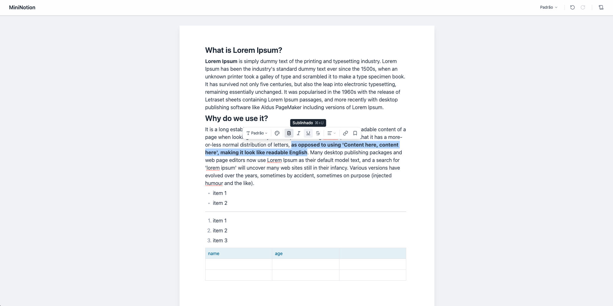

# Notion Clone

A lightweight, fast, and fully functional Notion-style editor built with **Next.js**, **React**, and **TypeScript** — with virtually zero external dependencies beyond the framework itself.



🔗 **[Live Demo](https://notion-clone-orcin-nine.vercel.app/)**

---

## Why?

Most rich-text editors rely on heavy libraries like ProseMirror, Slate, or TipTap. This project takes a different approach: **pure `contentEditable`** with custom React hooks — resulting in a tiny bundle, instant load times, and full control over behavior.

**Only 3 runtime dependencies:** Next.js, React, and Lucide icons. That's it.

---

## Features

### Block Types
- **Text** — Rich inline formatting (bold, italic, underline, strikethrough)
- **Headings** — H1, H2, H3
- **Bullet & Numbered Lists** — With indentation support (Tab / Shift+Tab)
- **Divider** — Horizontal separator
- **Table** — Multi-cell selection, row/column management, cell colors, context menu
- **Image** — Upload, resize, alignment (left/center/right), captions

### Editor Capabilities
- **Slash Menu (`/`)** — Quick command palette with filtering and aliases
- **Floating Toolbar** — Appears on text selection for inline formatting
- **Drag & Drop** — Reorder blocks with multi-block drag support and visual ghost preview
- **Multi-Block Selection** — Click-drag or Shift+Click to select multiple blocks
- **Undo / Redo** — Full history with debounced state tracking
- **Copy & Paste** — Smart clipboard handling (preserves formatting from external sources)
- **Pagination Mode** — Switch between continuous scroll and paginated view with automatic page-splitting
- **Custom Fonts** — Dynamic font loading with weight/style detection from local files
- **Notion-Style Colors** — 10-color palette for both text and background
- **Text Alignment** — Left, center, right, justify
- **Links** — Insert and edit hyperlinks inline
- **Block References** — Internal linking between blocks

### Keyboard Shortcuts
| Shortcut | Action |
|---|---|
| `Cmd/Ctrl + B` | Bold |
| `Cmd/Ctrl + I` | Italic |
| `Cmd/Ctrl + U` | Underline |
| `Cmd/Ctrl + Shift + X` | Strikethrough |
| `Cmd/Ctrl + Z` | Undo |
| `Cmd/Ctrl + Shift + Z` | Redo |
| `Cmd/Ctrl + A` | Select all blocks |
| `Tab / Shift+Tab` | Indent / Outdent lists |
| `/` | Open slash menu |
| `Esc` | Clear selection |

---

## Getting Started

```bash
# Clone the repo
git clone https://github.com/andreocunha/notion-clone.git
cd notion-clone

# Install dependencies
npm install

# Start dev server
npm run dev
```

Open [http://localhost:3000](http://localhost:3000) in your browser.

---

## Architecture

The editor is built as a **self-contained module** under `app/editor/` and can be imported as a library:

```tsx
import { NotionEditor } from './editor';
```

### Pluggable Data Source

The editor doesn't care how blocks are stored. Swap the default local state with **Yjs**, **Supabase**, or any custom backend:

```tsx
import { EditorProvider, useLocalDataSource } from './editor';

function App() {
  const dataSource = useLocalDataSource(initialBlocks);
  return <EditorProvider dataSource={dataSource}><NotionEditor /></EditorProvider>;
}
```

### Configuration

```tsx
<NotionEditor
  config={{
    pageContentHeight: 950,    // Page height in paginated mode (px)
    historyDebounceMs: 500,    // Undo/redo debounce window (ms)
    fetchFonts: customFetcher, // Replace default font API
  }}
/>
```

---

## Scripts

| Command | Description |
|---|---|
| `npm run dev` | Start development server |
| `npm run build` | Production build |
| `npm run start` | Start production server |
| `npm run test` | Run tests |
| `npm run test:watch` | Run tests in watch mode |
| `npm run lint` | Lint with ESLint |

---

## Tech Stack

- **Next.js** — App Router
- **React 19** — UI rendering
- **TypeScript** — Type safety
- **Tailwind CSS** — Styling
- **Vitest** — Testing
- **Lucide React** — Icons

---

## License

MIT
